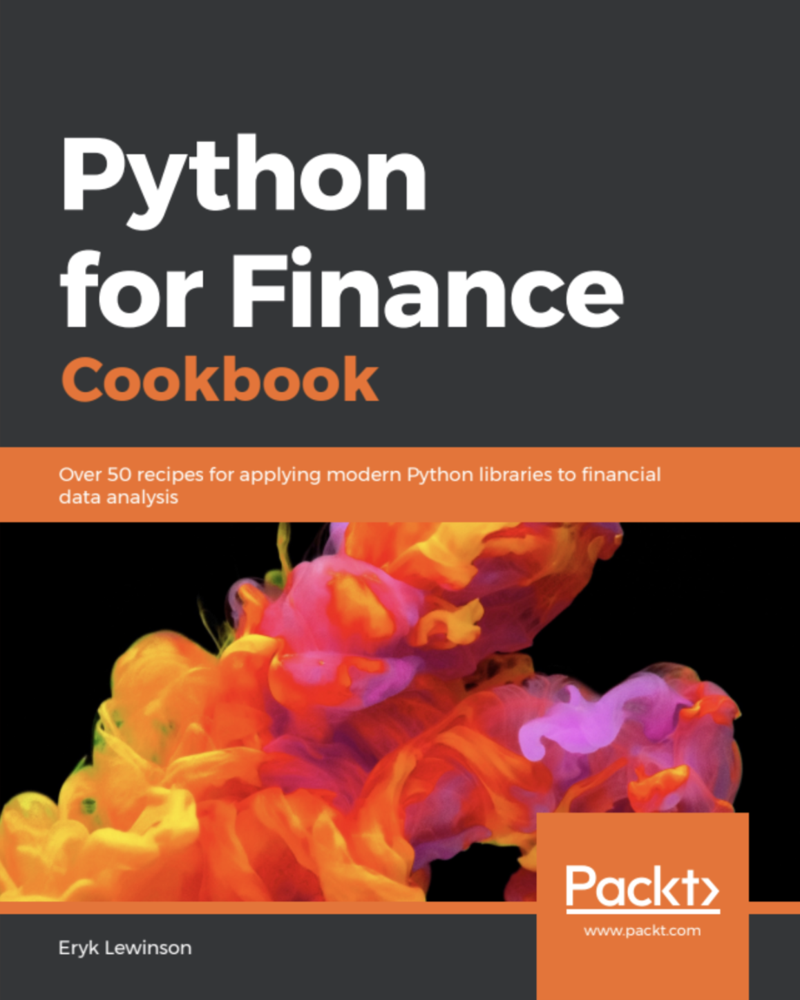

## $5 Tech Unlocked 2021!
[Buy and download this Book for only $5 on PacktPub.com](https://www.packtpub.com/product/python-for-finance-cookbook/9781789618518)
-----
*If you have read this book, please leave a review on [Amazon.com](https://www.amazon.com/gp/product/1789618517).     Potential readers can then use your unbiased opinion to help them make purchase decisions. Thank you. The $5 campaign         runs from __December 15th 2020__ to __January 13th 2021.__*

## Python For Finance Cookbook - Code Repository

**Python For Finance Cookbook**  
published: January 31st, 2020

Paperback: 432 pages  
Publisher: Packt Publishing  
Language: English

## Links

- [Amazon Page](https://www.amazon.com/Python-Finance-Cookbook-libraries-financial-dp-1789618517/dp/1789618517)
- [Packt Page](https://www.packtpub.com/data/python-for-finance-cookbook)

## Table of Contents

1. Financial Data and Preprocessing 
2. Technical Analysis in Python
3. Time Series Modeling
4. Multi-Factor Models
5. Modeling Volatility with GARCH Class Models
6. Monte Carlo Simulations in Finance
7. Asset Allocation in Python
8. Identifying Credit Default with Machine Learning
9. Advanced Machine Learning Models in Finance
10. Deep Learning in Finance

--- 

Eryk Lewinson. *Python For Finance Cookbook*. Packt Publishing, 2020.

    @book{Lewinson2019,  
    address = {Birmingham, UK},  
    author = {Lewinson, Eryk},  
    edition = {1},  
    isbn = {9781789618518},   
    publisher = {Packt Publishing},  
    title = {{Python For Finance Cookbook}},  
    year = {2020}  
    }